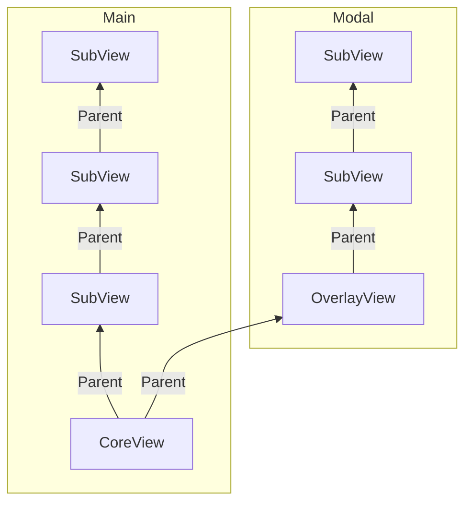
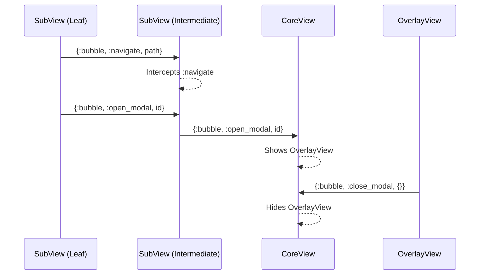

# LiveGrid

Structure your LiveViews, flow your events.

**LiveGrid** is a lightweight framework built on Phoenix LiveView that enforces a hierarchical structure for live views while simplifying event handling through bubbling. It fixes the "broken" model of nested LiveViews by defining three core components: `CoreView`, `SubView`, and `OverlayView`. Events bubble up from children to parents, with the `CoreView` managing navigation and modals, and intermediate `SubView`s able to intercept events as needed.

## Key Features

- **Hierarchical Structure**: Only `CoreView` connects to the router; `SubView`s nest hierarchically beneath it.
- **Event Bubbling**: Events flow upward automatically unless intercepted, using `send/2` and `handle_info/2`.
- **Modal Management**: `OverlayView`s are controlled by the `CoreView` via bubbled events.
- **No Nested LiveComponents**: Enforces a flat component structure for simplicity (enforcement TBD).
- **Lightweight**: Minimal boilerplate, with defaults logic in base modules and HTML left to the developer.

## Components

### `LiveGrid.CoreView`

The root LiveView, tied to the Phoenix router. It handles navigation and modal state by default.
- **Default Events**: `:navigate`, `:open_modal`, `:close_modal`.
- **Role**: Top of the hierarchy, orchestrating the app.

### `LiveGrid.SubView`
A nested LiveView that renders content and bubbles events to its parent. Automatically forwards unhandled events.
- **Role**: Hierarchical element, can intercept events if needed.

### `LiveGrid.OverlayView`
A modal LiveView managed by the `CoreView`. Includes a default `"close"` handler.
- **Role**: Transient UI layer, bubbles events to the `CoreView`.



 - **CoreView**: The root, connected to the router.
 - **SubView**: Nested elements, forming the hierarchy. -
 - **OverlayView**: Modal layer, managed by `CoreView`.

 ## Event Bubbling Flow

 - **Bubbling**: Events flow up (`SubView` → `SubView` → `CoreView`) unless intercepted.
 - **Intercept**: `S1` stops `:navigate` but forwards `:open_modal`.
 - **Modal**: `CoreView` manages `OverlayView` via bubbled events.

 ## Usage Example

 ### CoreView

 ```elixir
defmodule MyAppWeb.MyCoreView do
  use LiveGrid.CoreView
  alias MyAppWeb.MySubView

  def render(assigns) do
    ~H"""
    <div>
      <%= live_render(@socket, MyAppWeb.MyIntermediateSubView, id: "subview-1") %>
      <%= if @modal_open? do %>
        <div id="modal" class="modal-container">
          <%= live_render(@socket, MyAppWeb.MyOverlayView, id: "modal-overlay") %>
        </div>
      <% end %>
    </div>
    """
  end
end
```

### Intermediate SubView
```elixir
defmodule MyAppWeb.MyIntermediateSubView do
  use LiveGrid.SubView

  def render(assigns) do
    ~H"""
    <div>
      <%= live_render(@socket, MyAppWeb.MyLeafSubView, id: "leaf-subview") %>
    </div>
    """
  end

  def handle_info({:bubble, :update_x, payload}, socket) do
    # handle event
    {:noreply, intercept_event(socket)}
  end
end
```

 ### Leaf SubView
 ```elixir
defmodule MyAppWeb.MyLeafSubView do
  use LiveGrid.SubView

  def render(assigns) do
    ~H"""
    <div>
      <button phx-click="trigger_navigate" phx-target={@myself}>Navigate</button>
      <button phx-click="trigger_modal" phx-target={@myself}>Open Modal</button>
       <button phx-click="trigger_update_x" phx-target={@myself}>Update X</button>
    </div>
    """
  end

  def handle_event("trigger_navigate", _params, socket) do
    socket = bubble_event(socket, :navigate, %{"path" => "/new-page"})
    {:noreply, socket}
  end

  def handle_event("trigger_modal", _params, socket) do
    socket = bubble_event(socket, :open_modal, %{"id" => "some-modal"})
    {:noreply, socket}
  end

  def handle_event("trigger_update_x", _params, socket) do
    socket = bubble_event(socket, :update_x, %{"some" => "value"})
    {:noreply, socket}
  end
end
```

### OverlayView
 ```elixir
defmodule MyAppWeb.MyOverlayView do
  use LiveGrid.OverlayView

  def render(assigns) do
    ~H"""
    <div class="modal">
      <p>Custom modal content</p>
      <button phx-click="close" phx-target={@myself} class="my-close-btn">X</button>
    </div>
    """
  end
end
```

## Getting Started
1. Add `LiveGrid` to your project.
2. Define a `CoreView` tied to a route in your router.
3. Nest `SubView`s and trigger events with `bubble_event/3`.
4. Use `OverlayView` for modals, controlled by `CoreView`.

