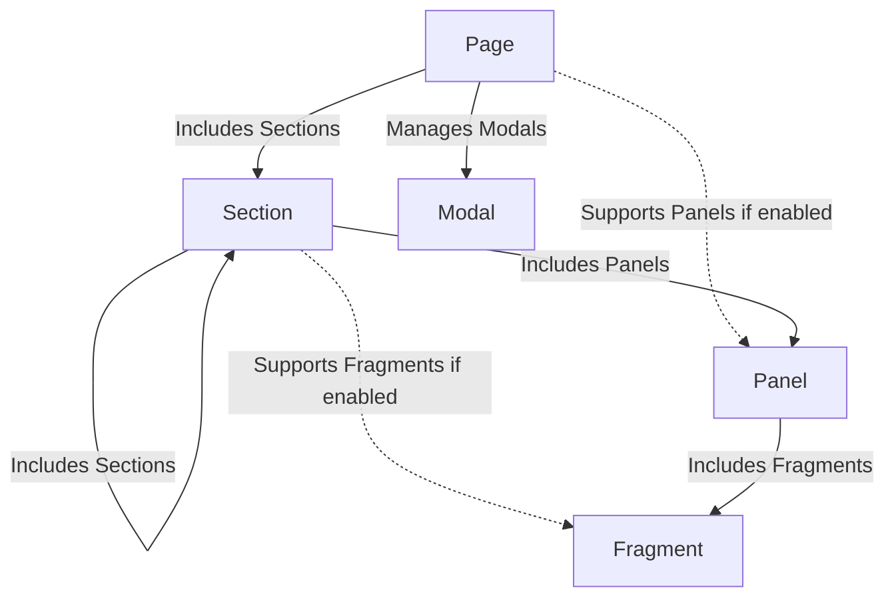
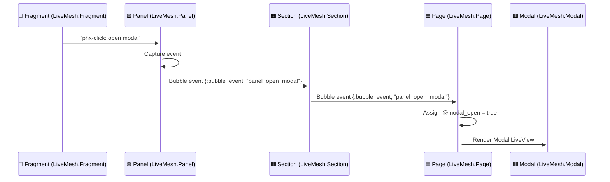
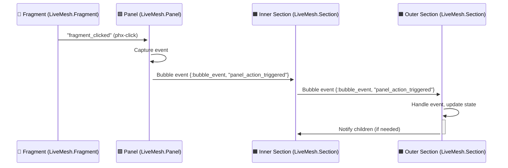

# LiveMesh: Structured UI Framework for LiveView

**LiveMesh** is a **lightweight, opinionated framework** for structuring complex UI in LiveView.  
It enforces a **clear, scalable hierarchy** while preventing UI complexity.

## 🚀 **Why Use LiveMesh?**


✅ **Structured UI Hierarchy** → **Page → Sections → Panels → Fragments**, No more deep nesting & confusion—LiveMesh enforces a clear Page → Section → Panel → Fragment hierarchy.  
✅ **Event Bubbling Support** → Events naturally flow upward through Panels → Sections → Page, preventing tight coupling and making UI interactions predictable.  
✅ **Optional & Explicit Features** → Features like Panels, Fragments, and Modals are opt-in, keeping the UI lightweight and intentional.  
✅ **Scales with Complexity** → Works for both small applications and large-scale projects by enforcing reusability and modularity..  
✅ **Predictable Modal Handling** → By default only Pages manage modals, preventing scattered state management.  
✅ **No Nested LiveComponents** → LiveComponents were never designed for hierarchical nesting, yet many LiveView projects struggle with deeply nested LiveComponents. LiveMesh solves this by using LiveViews for structure and LiveComponents only as UI Fragments.  
✅ **Phoenix LiveView Native** → Fully compatible with LiveView’s real-time UI model, leveraging LiveComponents only for isolated UI elements..  
✅ **Lightweight & Opinionated** → Fully compatible with LiveView’s real-time UI model, leveraging LiveComponents only for isolated UI elements.  
✅ **Encourages Collaboration** →  With a consistent structure, teams can quickly understand and extend the codebase without reinventing UI patterns.  

---

## 📂 **Core Components of LiveMesh**
LiveMesh provides **five main building blocks**:

| Component      | Type | Description |
|---------------|------|------------|
| **Page**      | LiveView | The **top-level structure**, managing sections (by default). Can enable Panels (`use LiveMesh.Panels`). **Manages modals by default**. |
| **Section**   | LiveView | A **nested unit** inside a Page. By default, only contains **Sections & Panels**. Can enable Fragments (`use LiveMesh.Fragments`). **Can enable modal support (`use LiveMesh.Modals`).** |
| **Panel**     | LiveView | A **strict leaf-level container**, holding only Fragments. |
| **Fragment**  | LiveComponent | A **small, reusable UI piece**, inside a Section or Panel. |
| **Modal**     | LiveView | **By default, only managed by a `Page`**. **Sections can enable modal support explicitly with `use LiveMesh.Modals`**. |

✅ Default behaviors:
* Pages support Sections by default.
* Modals are only supported by Pages unless use LiveMesh.Modals is enabled in a Section.
* Sections support only Sections and Panels unless use LiveMesh.Fragments or use LiveMesh.Modals is enabled.

✅ Optional behaviors:
* Panels in Pages require use LiveMesh.Panels.
* Fragments in Sections require use LiveMesh.Fragments.
* Modals in Sections require use LiveMesh.Modals.

---

## 🏗️ **LiveMesh Architecture**
### **🔷 Hierarchy with New Defaults**
LiveMesh follows a **structured hierarchy**, ensuring modular UI composition.


    
## 🏗️ **Example LiveMesh Page Hierarchy**
### **🔷 Full Page Example with All Possible Components**
Below is an **example of how a LiveMesh page can be structured** with different nesting levels.

```
MyPageLive (LiveMesh.Page)
│── Section1 (LiveMesh.Section)
│   │── SubSection (LiveMesh.Section)
│   │── Panel2 (LiveMesh.Panel)
│   │   │── Fragment B (LiveMesh.Fragment)
│   │   │── Fragment C (LiveMesh.Fragment)
│   │── Fragment A (LiveMesh.Fragment)  [Optional: Requires `use LiveMesh.Fragments`]
│   │── Modal (LiveMesh.Modal)  [Optional: Requires `use LiveMesh.Modals`]
│
│── Section2 (LiveMesh.Section)
│
│── Panel1 (LiveMesh.Panel)  [Optional: Requires `use LiveMesh.Panels`]
│
│── Modal (LiveMesh.Modal)  [Managed by `Page` by default]
```

## 🔥 Event Bubbling in LiveMesh
LiveMesh uses **event bubbling** to ensure that **Panels, Sections, and Pages** can communicate **without tight coupling**.

### **📌 How Event Bubbling Works**
- **Events triggered in Panels** automatically **bubble up to their parent Section**.
- **Sections listen for events from their Panels** and **can either handle them or pass them up** to the Page.
- **Pages listen for events from Sections** and **can use them to trigger global actions**, like opening modals.

🚀 1️⃣ Sequence Diagram: Event Bubbling to the Page
* The Fragment triggers a phx-click event, which is sent to its parent Panel.
* The Panel then triggers a LiveMesh event (panel_open_modal).
* The event bubbles up through the Section to the Page, which handles it by opening the modal.



### **🚀 2️⃣ Sequence Diagram: Event Captured at Section Level**
* A Fragment inside a Panel triggers a phx-click event.
* The Panel captures it and sends a new event (panel_action_triggered).
* This event bubbles through two Sections and is finally handled by OuterSection.

