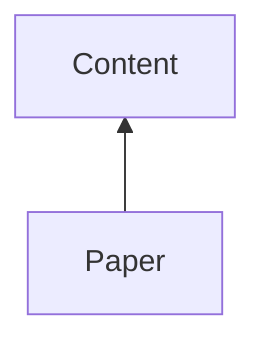
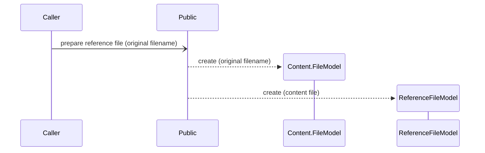
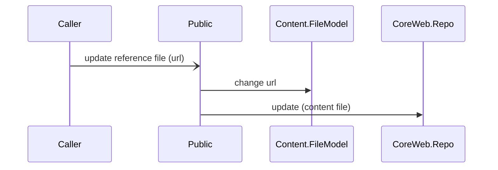
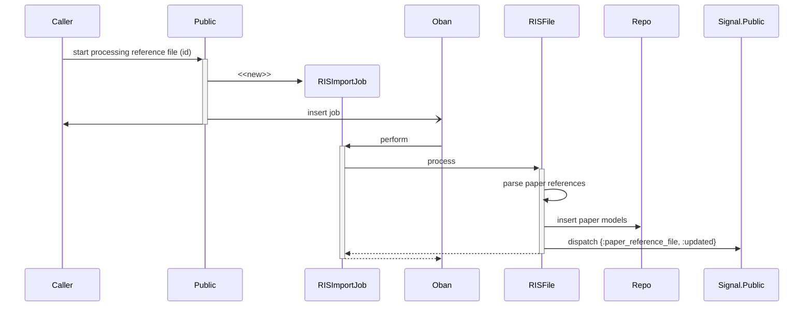
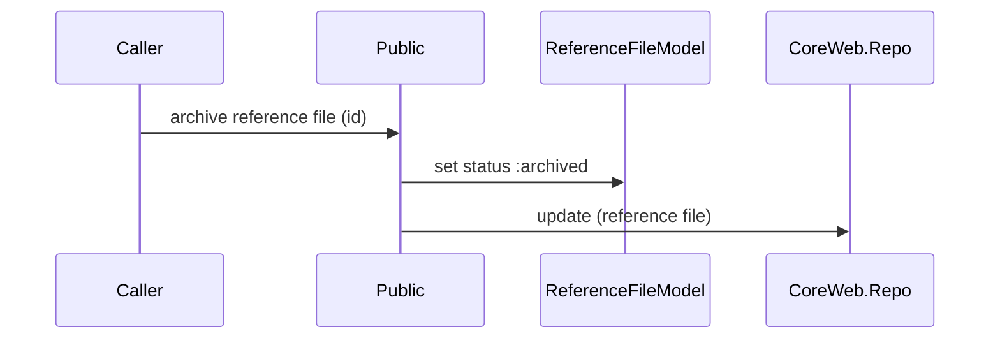

# Paper

System for managing Paper resources. Supports importing RIS format reference files.

## Dependencies



## Data model

  ```mermaid
    classDiagram

    Content.FileModel <-- ReferenceFileModel
    ReferenceFileModel --> "many" Model
    ReferenceFileModel --> "many" ReferenceFileErrorModel
    Model <-- RISModel
  ```

## Public Use Cases

### Prepare Reference File

The reference file is created but not inserted in the database yet



### Update Reference File



### Processing Reference File

Asynchronous process to persist all valid (RIS) references found in the file. When processing the reference file has finished, the signal `{:paper_reference_file, :updated}` will be dispatched.



### Archive Reference File

