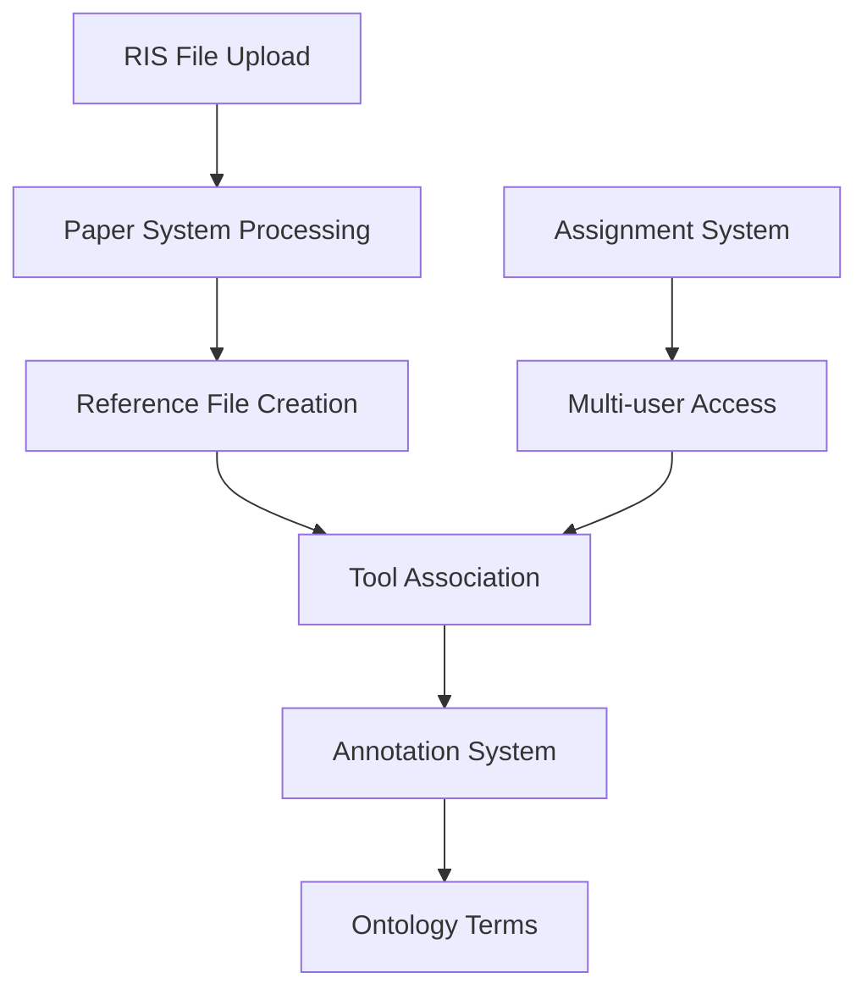

# Zircon System

## Overview

Zircon is a comprehensive **systematic literature review platform** that serves as the **foundational knowledge population tool** for the EYRA knowledge graph. As the first system to populate the Annotation/Ontology layers, Zircon transforms systematic literature review from a specialized academic task into a **universal research capability** that feeds the next-generation knowledge system. Every researcher's systematic review contributes to a growing, AI-enhanced knowledge base.

## Purpose

- **Daily Research Integration**: Seamlessly integrates into researchers' daily workflows
- **Knowledge Graph Seeder**: Primary tool for populating the Annotation/Ontology knowledge layers
- **Universal Research Tool**: Systematic review capability needed by every researcher
- **Structured Knowledge Creation**: Captures detailed annotations that feed the knowledge graph
- **AI-Enhanced Discovery**: Leverages AI to extract and formalize research insights
- **Future Publishing Foundation**: Creates structured knowledge for AI-generated paper summaries

## Architecture

### Core Models

#### `Systems.Zircon.Screening.ToolModel`
- **Central Model**: Represents a screening tool instance
- **Authorization**: Integrates with hierarchical permission system via `auth_node`
- **Protocols**: Implements `Frameworks.Concept.ToolModel` and `Frameworks.Concept.Leaf`
- **Associations**: Connected to reference files and annotations

#### Association Models
```elixir
# Tool-Paper Relationship
Systems.Zircon.Screening.ToolReferenceFileAssoc
- belongs_to(:tool, Screening.ToolModel)
- belongs_to(:reference_file, Paper.ReferenceFileModel)

# Tool-Annotation Relationship
Systems.Zircon.Screening.ToolAnnotationAssoc
- belongs_to(:tool, Screening.ToolModel)
- belongs_to(:annotation, Annotation.Model)
```

### Data Flow Architecture



## System Integration

## Knowledge Graph Population Strategy

### Primary Knowledge Seeder
Zircon serves as the **foundational tool** for populating the knowledge graph:

```
Literature Review → Systematic Screening → Research Annotations → AI Formalization → Knowledge Graph
```

#### Universal Research Application
- **Every Researcher Needs This**: Systematic review is a fundamental research skill
- **Broad Adoption Potential**: Universal applicability across research domains
- **Knowledge Network Effect**: Each review contributes to collective knowledge
- **Research Quality**: Improved systematic review leads to better research outcomes

### Knowledge Creation Pipeline: From Daily Work to Published Research

#### Literature Processing → Structured Knowledge → AI-Generated Papers
- **Daily Integration**: Systematic review as part of normal research workflow
- **Structured Annotation**: Every screening decision becomes detailed semantic annotation
- **Knowledge Accumulation**: Annotations continuously feed into researcher's knowledge graph
- **AI Formalization**: AI agents extract concepts and predicates from research annotations
- **Paper Generation**: AI synthesizes structured knowledge into traditional paper format
- **Knowledge-First Publishing**: Papers become summaries of rich, structured knowledge bases

#### Research Workflow Transformation
```
Traditional: Research → Write Paper → Publish
Future: Research + Annotate → Knowledge Graph → AI Paper Summary → Publish + Knowledge
```

#### Research Workflow Integration
- **Built on Assignment System**: Multi-user collaborative research workflows
- **Real-time Collaboration**: Live updates and distributed work coordination
- **Quality Assurance**: Multiple reviewer validation and consensus building
- **Knowledge Attribution**: Track contributions and maintain research provenance

### Knowledge Graph Growth Strategy

#### Phase 1: Systematic Review Foundation (Current)
- **Zircon as Primary Seeder**: First tool to populate Annotation/Ontology layers
- **Research Domain Coverage**: Academic and medical research literature
- **Collaborative Knowledge Building**: Multi-user teams building shared knowledge
- **AI-Enhanced Processing**: Automated extraction and formalization

#### Phase 2: Additional Tools Integration (Future)
- **Survey Tools**: Populate knowledge from survey research
- **Experimental Tools**: Extract knowledge from experimental data
- **Qualitative Research Tools**: Formalize insights from qualitative studies
- **Data Analysis Tools**: Convert statistical findings into formal knowledge

## Key Features

### File Import Workflow
1. **File Upload**: Drag-and-drop RIS bibliography files
2. **Background Processing**: Oban jobs parse files and extract metadata
3. **Duplicate Detection**: Automatic identification of duplicate papers
4. **Error Tracking**: Comprehensive error capture and display
5. **Import History**: Complete audit trail of operations

### Knowledge Extraction Categories
Zircon transforms established research methodologies into **knowledge creation frameworks**:

#### Research Element Formalization
- **Population** → **Subject Concepts**: "Elderly patients", "University students"
- **Intervention** → **Action Concepts**: "Cognitive behavioral therapy", "Machine learning"
- **Comparison** → **Relationship Predicates**: "More effective than", "Similar to"
- **Outcome** → **Result Concepts**: "Reduced anxiety", "Improved accuracy"
- **Context** → **Environmental Concepts**: "Hospital setting", "Online environment"

#### Knowledge Graph Contribution
Each systematic review contributes:
- **Domain Concepts**: Field-specific terminology and definitions
- **Research Relationships**: Evidence-based connections between concepts
- **Methodological Knowledge**: Research design and validation patterns
- **Cross-Domain Insights**: Connections between different research areas

### Real-time Collaboration
- **Signal-based Updates**: Event-driven architecture for live updates
- **Multi-user Access**: Simultaneous screening by team members
- **Assignment Integration**: Work distribution and progress tracking
- **Authorization**: Granular permission control

## Public API

### Tool Management
```elixir
# Tool Operations
Zircon.Public.get_screening_tool!(id, preload \\ [])
Zircon.Public.get_screening_tool_by_reference_file!(reference_file, preload \\ [])
Zircon.Public.prepare_screening_tool(attrs, auth_node)

# Reference File Operations
Zircon.Public.insert_reference_file!(tool, original_filename)
Zircon.Public.list_reference_files(tool)
Zircon.Public.list_screening_tool_reference_files(tool)
```

### Signal Handling
The system participates in event-driven architecture:

```elixir
# Signal Flow Example
{:paper_reference_file, :updated} -> Zircon.Switch
-> {:zircon_screening_tool, :updated} -> Assignment System
```

## AI-Enhanced Knowledge Creation

### Knowledge Formalization AI
Zircon's AI integration focuses on **knowledge extraction and formalization**:

#### Research Pattern Recognition
- **Concept Extraction**: AI identifies recurring research concepts from annotations
- **Relationship Discovery**: AI discovers evidence-based relationships between concepts
- **Methodology Patterns**: AI recognizes effective research design patterns
- **Cross-Study Synthesis**: AI identifies patterns across multiple systematic reviews

#### Selectical Integration for Knowledge Building
- **Evidence Synthesis**: AI synthesizes findings across multiple papers
- **Concept Validation**: AI suggests formal concepts based on research evidence
- **Relationship Mapping**: AI maps evidence-based relationships between research concepts
- **Knowledge Quality Assessment**: AI evaluates strength of evidence for knowledge claims

### Universal Research Enhancement

#### AI-Powered Research Assistance
- **Intelligent Screening**: AI learns from researcher decisions to improve future screening
- **Research Gap Identification**: AI identifies understudied areas in knowledge graph
- **Methodology Recommendations**: AI suggests optimal research approaches based on knowledge patterns
- **Literature Discovery**: AI recommends relevant papers based on formalized knowledge

## File Format Support

### RIS (Research Information Systems)
- **Primary Format**: Standard bibliography format
- **Robust Processing**: Handles malformed files gracefully
- **Error Recovery**: Continues processing despite individual record errors
- **Encoding Support**: Multiple character encodings

## User Interface

### Import Interface
- **File Selector**: Drag-and-drop upload with progress tracking
- **Import History**: Table showing processing status and errors
- **Paper Counts**: Live display of unique papers in system
- **Error Display**: Detailed error information for debugging

### Screening Interface (Planned)
- **Paper Display**: Structured presentation of paper metadata
- **Annotation Tools**: Interface for applying structured tags
- **Category Selection**: Dropdown/selection for screening criteria
- **Progress Tracking**: Visual indicators of screening progress

## Configuration Requirements

### Database Schema
- `zircon_screening_tool`: Core tool instances
- `zircon_screening_tool_reference_file`: Tool-file associations
- `zircon_screening_tool_annotation`: Tool-annotation links
- Dependencies on Paper, Annotation, and Ontology tables

### System Dependencies
- **Paper System**: File processing and paper management
- **Annotation System**: Structured tagging and categorization
- **Ontology System**: Term definitions and semantic structure
- **Assignment System**: Multi-user workflows and authorization
- **Oban**: Background job processing for file imports

## Development Status

### ✅ Knowledge Foundation (Implemented)
- RIS file import and paper corpus creation
- Multi-user collaborative screening workflows
- Real-time annotation creation and sharing
- Integration with Annotation/Ontology systems
- Foundation for AI-driven knowledge extraction

### 🔄 Knowledge Formalization (In Development)
- AI-enhanced screening decision support
- Automated concept extraction from annotations
- Evidence-based relationship discovery
- Human validation of AI-synthesized knowledge

### 📋 Universal Research Platform (Planned)
- Cross-domain systematic review capabilities
- AI-powered research methodology recommendations
- Advanced knowledge graph visualization
- Integration with additional research tools
- Knowledge export and sharing capabilities

## Strategic Importance: Transforming Research Publication

### Research Workflow Revolution
- **Daily Integration**: Tools seamlessly integrate into researchers' daily workflows
- **Knowledge-First Research**: Structured annotations become primary research output
- **AI Paper Generation**: Traditional papers become AI-generated summaries
- **Rich Knowledge Foundation**: Detailed knowledge graphs support paper summaries
- **New Publishing Paradigm**: Papers + structured knowledge + full provenance

### Future Research Ecosystem
- **Integrated Research Tools**: Multiple tools feeding into unified knowledge graph
- **Continuous Knowledge Building**: Research knowledge accumulates throughout project lifecycle
- **Pre-Publication Knowledge**: Rich, structured knowledge exists before paper writing
- **AI Research Assistance**: AI helps generate papers from accumulated knowledge
- **Knowledge Persistence**: Structured knowledge outlasts and enhances traditional papers

### Publishing Industry Transformation
- **Enhanced Peer Review**: Reviewers access structured knowledge behind papers
- **Reproducible Research**: Complete knowledge graphs enable full research reproduction
- **Living Papers**: Papers can evolve as underlying knowledge graphs are updated
- **Knowledge Citation**: Citations link to specific knowledge elements, not just papers
- **Research Verification**: Structured knowledge enables automated fact-checking

## Development Guidelines

### Plugin Architecture
- Design new features as modular plugins
- Implement standard interfaces for extensibility
- Consider future AI engine integration points
- Maintain separation between core and plugin functionality

### Data Integrity
- Ensure referential integrity across systems
- Handle cascade operations properly
- Validate data consistency in associations
- Implement proper error handling for file processing

### Performance Considerations
- Use background jobs for file processing
- Implement efficient querying for large paper sets
- Consider caching for frequently accessed data
- Optimize real-time updates through signals

### User Experience
- Maintain responsive UI during file processing
- Provide clear progress indicators
- Display meaningful error messages
- Support collaborative workflows

## Future Enhancements

### AI Integration
- Plugin system for multiple AI engines
- Configurable AI assistance levels
- Machine learning model training on annotation data
- Automated quality assessment

### Advanced Features
- Full-text PDF processing
- Citation network analysis
- Advanced search and filtering
- Export capabilities for review results
- Integration with reference management tools

### Scalability
- Distributed processing for large datasets
- Caching strategies for performance
- Database optimization for complex queries
- Real-time collaboration enhancements