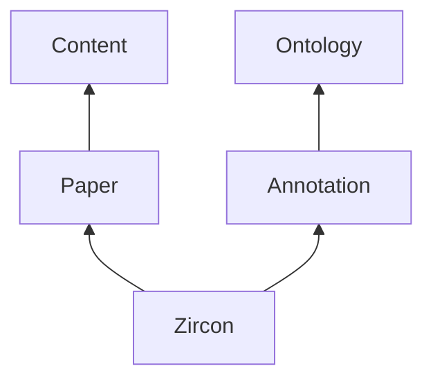
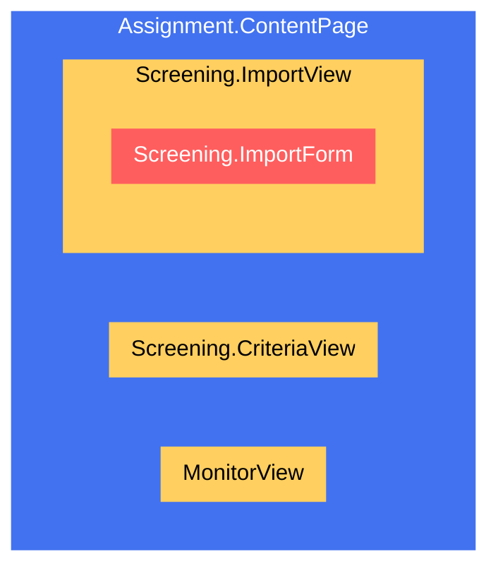
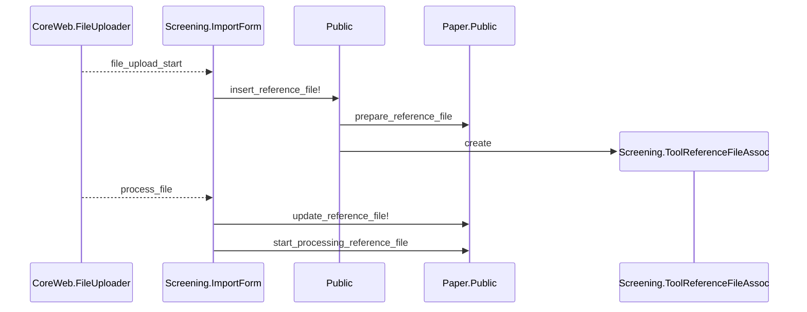
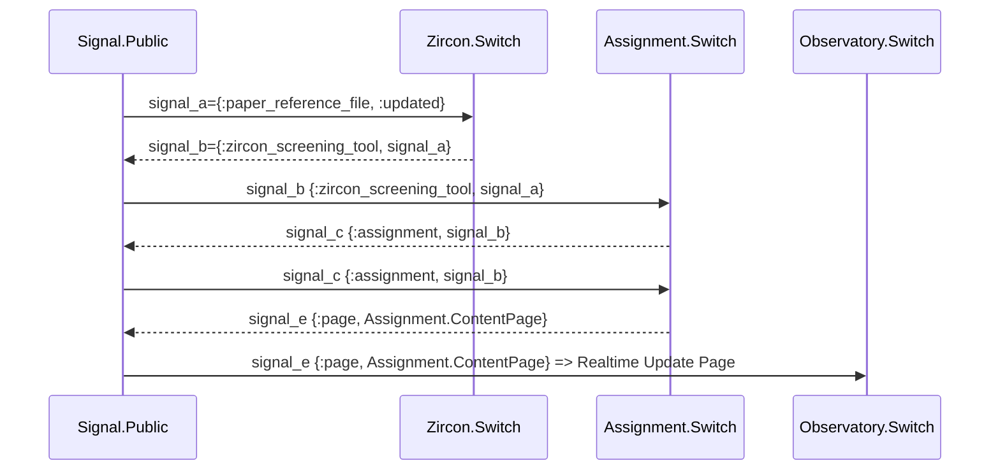

# Zircon

A comprehensive Literature Review application designed to streamline the review process. It comprises two distinct tools, each representing a key phase of a Literature Review:

* Screening Phase: Title and Abstract Review
* Selection Phase: Full-Text Review

# Dependencies



# Tools

## Screening

### Data Model

  ```mermaid
  classDiagram
    Ontology.TermModel <-- Annotation.Model
    Paper.ReferenceFileModel "many" <-- Screening.ToolModel
    Annotation.Model "many" <-- Screening.ToolModel
    Paper.Model "many" <-- Paper.ReferenceFileModel
  ```

### Page composition

#### Content Page



### Import reference file

#### Upload and start processing file



#### Reference file updated event

When processing the reference file has finished, the Paper system will dispatch a {:paper_reference_file, :updated} signal. This will eventually lead to an update of the Assignment.ContentPage containing the Screening.ImportForm.



## Selection

Our current focus is on the development and refinement of the Screening tool.


